# Dokumentasi Cloud Computing

==========================
### Biodata

PBL: Kelompok 5

Nama Anggota:
1. Muhammad Yoanvari Al Farizi
2. Mozzarino Khaira Akbar
3. Ratnasari
4. Riski Abdi Rahmawan
5. Sandra Devia Arge

Cloud: Azure

Service yang digunakan:
1. Azure VM
2. Azure Virtual Network
3. Azure Network Security Group

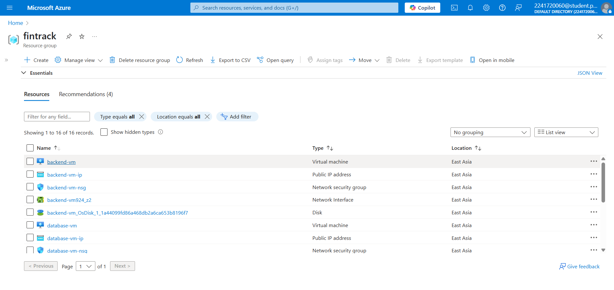

==========================

## Perencanaan Proyek
### Tujuan Proyek
Proyek ini bertujuan untuk membuat sistem informasi keuangan sport center untuk mengelola transaksi, perencanaan anggaran, dan rekaptulasi keuangan dengan menggunakan cloud computing sebagai infrastruktur publikasi.
### Ruang Lingkup Cloud Computing Proyek
* Implementasi infrastruktur berbasis cloud menggunakan VM dan VCN.
* Penggunaan NSG untuk mengatur akses ke sumber daya cloud.
* Pengelolaan kontainer menggunakan Docker dan Portainer.
* Otomatisasi CI/CD untuk deployment berkelanjutan.

### Langkah-Langkah Proyek
1. Perencanaan: Menyusun rencana termasuk mengindetifikasi kebutuhan infrastruktur cloud.
2. Implementasi: Membuat infrastruktur cloud menggunakan Azure VM, VCN, dan NSG, termasuk setup docker dan portainer
3. Deployment: Deploy sistem yang dibuat serta konfigurasi CI/CD untuk deployment berkelanjutan.

## Implementasi
### Virtual Cloud Network (VCN)
* Nama: fintrack-vnet
* Location: East Asia
* Address Space: 10.0.0.0/16
* Subnet: app-subnet (10.0.1.0/24)
### Virtual Machine
1. Virtual Machine Frontend
* #### Spesifikasi
* Nama: frontend-vm
* Location: East Asia
* Operating System: Linux (Ubuntu 24.04)
* Size: Standard B1ms (1 vcpu 2 GiB memory)
* Virtual Network / Subnet: fintrack-vnet/app-subnet
* #### Layanan yang digunakan
* Docker dan Docker Compose

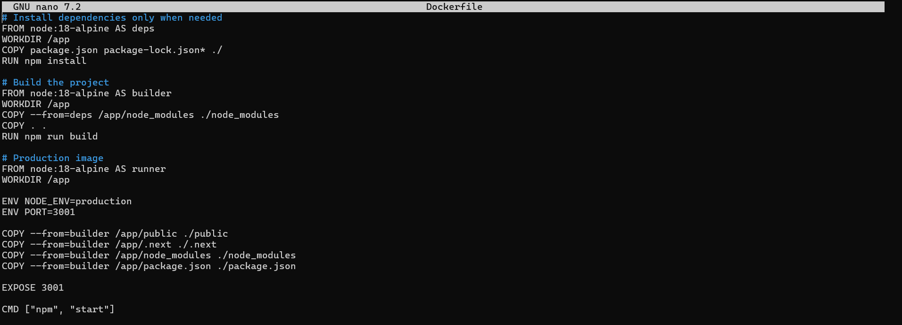

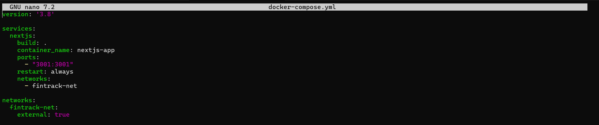
* Portainer

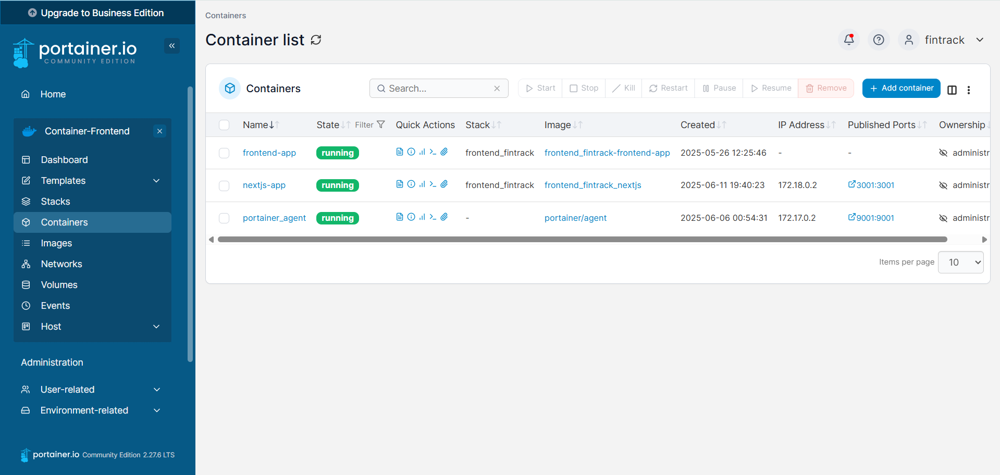
* Github Action

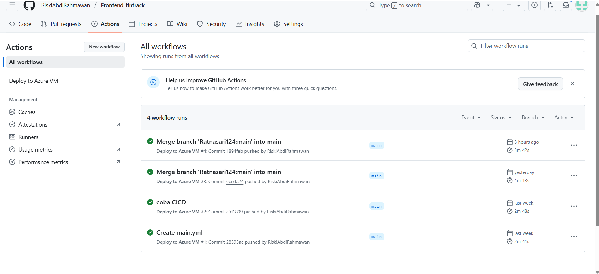

2. Virtual Machine Backend
* #### Spesifikasi
* Nama: backend-vm
* Location: East Asia
* Operating System: Linux (Ubuntu 24.04)
* Size: Standard B1ms (1 vcpu 2 GiB memory)
* Virtual Network / Subnet: fintrack-vnet/app-subnet
* #### Layanan yang digunakan
* Docker dan Docker Compose

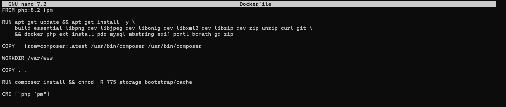

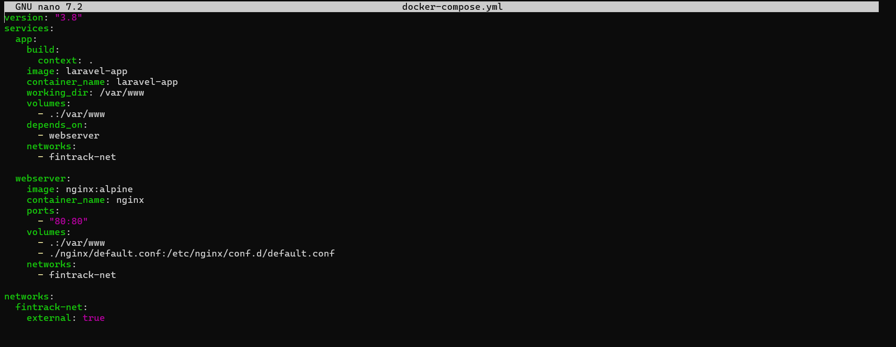

* Portainer

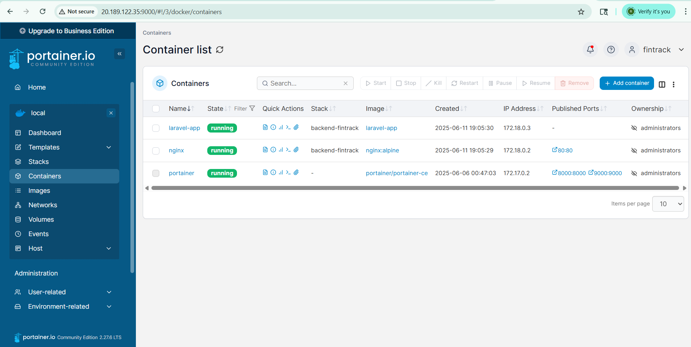

* Webhook

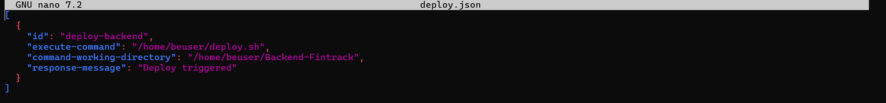

* Github Action

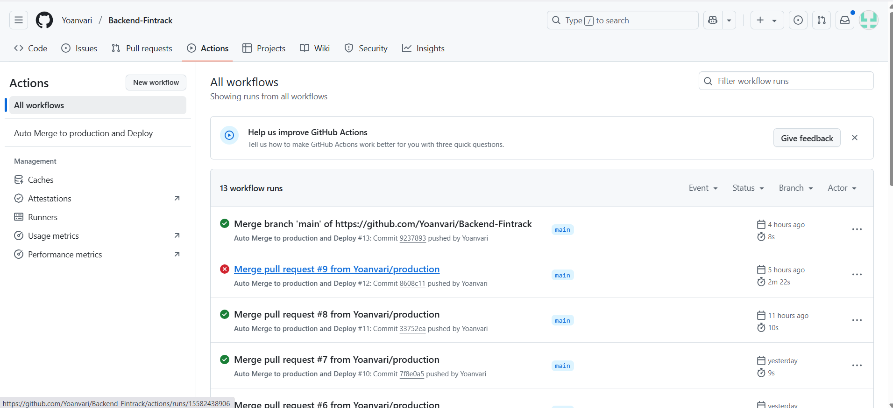

3. Virtual Machine Database
* #### Spesifikasi
* Nama: database-vm
* Location: East Asia
* Operating System: Linux (Ubuntu 24.04)
* Size: Standard B1ms (1 vcpu 1 GiB memory)
* Virtual Network / Subnet: fintrack-vnet/app-subnet
* #### Layanan yang digunakan
* Docker dan Docker Compose

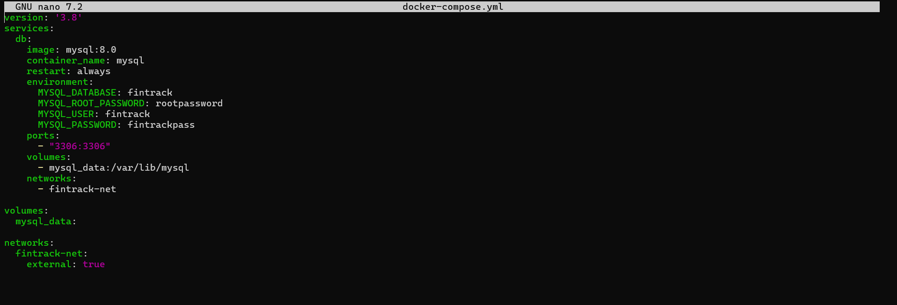

* Portainer

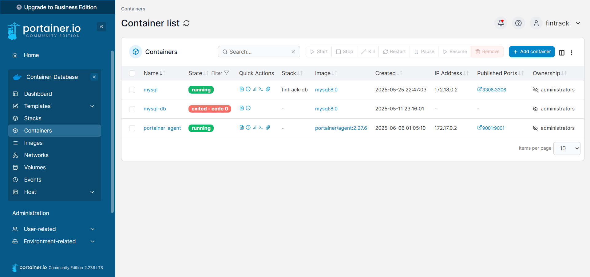

### Network Security Group

#### Port yang di Expose
##### VM Frontend
* 80 (HTTP)
* 22 (SSH)
* 443 (HTTPS)
* 3001(Docker)
* 9001(Portainer)

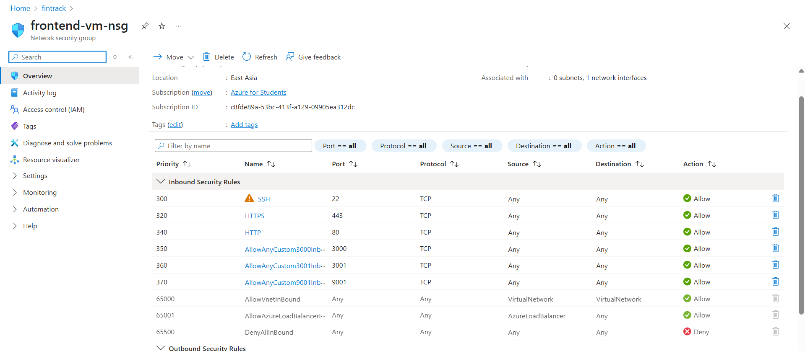

##### VM Backend
* 80 (HTTP)
* 22 (SSH)
* 443 (HTTPS)
* 9100(Webhook)
* 9000(Portainer)

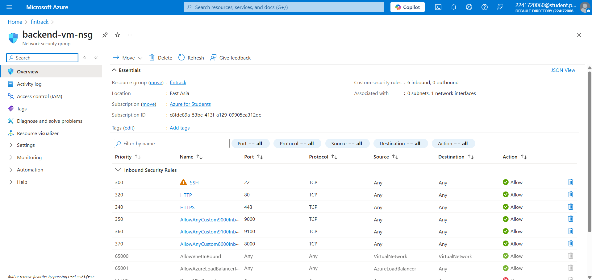

##### VM Database
* 80 (HTTP)
* 22 (SSH)
* 443 (HTTPS)
* 9001(Portainer)

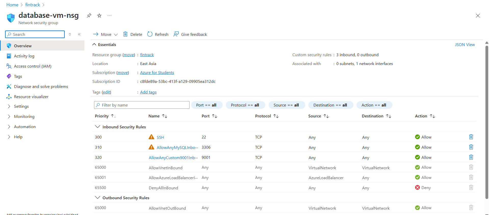